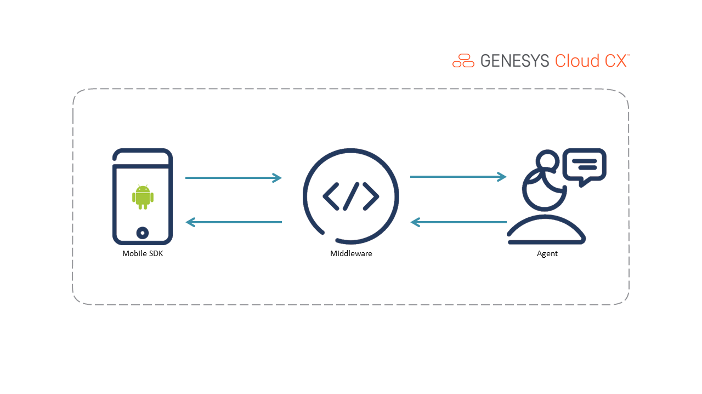

# Build an android mobile app that uses the Mobile SDK for web messaging

> View the full [Build an android mobile app that uses the Mobile SDK for web messaging](https://developer.mypurecloud.com/blueprints/mobilesdk-sample-android/ "Goes to the Build an android mobile app that uses the Mobile SDK for web messaging Blueprint") in the Genesys Cloud Developer Center.

This Genesys Cloud Developer Blueprint builds an android mobile app that uses the Mobile SDK for web messaging. You deploy all the components used in this solution with the Terraform Genesys Cloud CX as Code provider.

