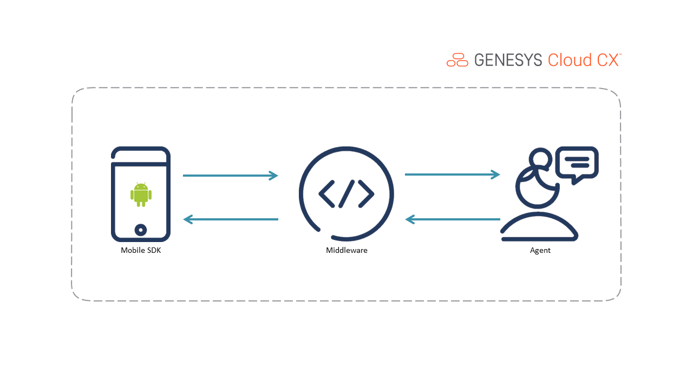

   ---
title: Build an Android Mobile Messaging app that uses the mobile SDK for web messaging
author: agnes.corpuz
indextype: blueprint
icon: blueprint
image: images/overview.png
category: 7
summary: |
  This Genesys Cloud Developer Blueprint explains how to develop an Android mobile app that uses the mobile SDK for web messaging. Deploy all the components used in this solution with the Terraform Genesys Cloud CX-as-Code provider.
---
:::{"alert":"primary","title":"About Genesys Cloud Blueprints","autoCollapse":false} 
Genesys Cloud blueprints help you get started with building an application or integrating with a third-party partner. 
Blueprints outline the procedure to build and deploy your solutions; they do not provide a production-ready, turnkey solution.
 
For more details on Genesys Cloud blueprint support and practices 
please see our Genesys Cloud blueprint [FAQ](https://developer.genesys.cloud/blueprints/faq) sheet.
:::

This Genesys Cloud Developer Blueprint explains how to develop an Android mobile app that uses the mobile SDK for web messaging. Deploy all the components used in this solution with the Terraform Genesys Cloud CX-as-Code provider.


* [Scenario](#scenario "Goes to the Scenario section")
* [Solution components](#solution-components "Goes to the Solution components section")
* [Prerequisites](#prerequisites "Goes to the Prerequisites section")
* [Implementation steps](#implementation-steps "Goes to the Implementation steps section")
* [Additional resources](#additional-resources "Goes to the Additional resources section")


## Scenario

An organization wants to allow their customers to start a web message with an agent from their mobile application:

1. **Customer initiates an interaction and the agent answers.** 

2. **The agent and customer interact via web message.**

3. **The agent or the customer ends interaction.**

## Solution components

* **Genesys Cloud CX** - A suite of Genesys cloud services for enterprise-grade communications, collaboration, and contact center management. In this solution, you use Architect inbound message flow, Genesys Cloud integration, Genesys Cloud queue, web messaging configuration, and web messaging deployment. 
* **Genesys Cloud Mobile Messenger SDK** - Genesys Cloud Mobile Messaging provides customers with an enhanced experience when they are using your mobile app. Mobile Messaging enables a visitor to log in to your app, converse with an agent, and return later to pick up the conversation. Genesys Cloud retains conversation history internally, which is retrieved at the beginning of the next conversation. This functionality enables you to seamlessly navigate through past messages from the ongoing conversation.
* **CX as Code** - A Genesys Cloud Terraform provider that provides an interface for declaring core Genesys Cloud objects.

## Prerequisites

### Specialized knowledge

* Administrator-level knowledge of Genesys Cloud
* Experience with Terraform

### Genesys Cloud account

* A Genesys Cloud license - Choose a plan suitable for your business. For more information, see [Genesys Cloud Pricing](https://www.genesys.com/pricing "Opens the Genesys Cloud pricing page on the Genesys website").
* The Master Admin role - The admin permissions that allow you to perform various tasks. For more information, see [Roles and permissions overview](https://help.mypurecloud.com/?p=24360 "Opens the Roles and permissions overview article in the Genesys Cloud Resource Center").
* CX as Code - A tool to declaratively manage Genesys Cloud resources and configuration across organizations using Terraform By HashiCorp. For more information, see [CX as Code](https://developer.genesys.cloud/devapps/cx-as-code/ "Goes to the CX as Code page in the Genesys Cloud Developer Center").

### Development tools
* Terraform (the latest binary) - Development tool that runs in your local environment. For more information, see [Download Terraform](https://www.terraform.io/downloads.html "Goes to the Download Terraform page on the Terraform website").

## Implementation steps

### Download the repository that contains the project files

1. Clone the [mobilesdk-sample-android repository](https://github.com/GenesysCloudBlueprints/mobilesdk-sample-android "Opens the mobilesdk-sample-android repository in GitHub").

### Set up Genesys Cloud

1. To run this project using the Terraform provider, open a Terminal window, and set up the following environment variables:

   * `GENESYSCLOUD_OAUTHCLIENT_ID` - The Genesys Cloud client credential grant ID. This is the variable against which CX-as-Code executes. 
   * `GENESYSCLOUD_OAUTHCLIENT_SECRET` - The Genesys Cloud client credential secret. This is the variable against which CX-as-Code executes. 
   * `GENESYSCLOUD_REGION` - The variable for Genesys Cloud region in your organization.

2. Run Terraform in the folder in which you set the environment variables. 

### Configure your Terraform build

In the **blueprint/terraform/dev.auto.tfvars** file, set the following values, which are specific to your Genesys Cloud organization:

* `email`    - Enter the email account that you use with Genesys Cloud. It will be used to assign you an appropriate Genesys Cloud queue.
* `division` - Enter the division to which the flow is deployed. By default, the new flows are deployed to the **Home** division.

The following is an example of the **dev.auto.tfvars** file.

```
email    = "user@company.com"
division = "Home"
```

### Run Terraform

You are now ready to run this blueprint solution for your organization.

1. Change to the **/terraform** folder.
2. Run the following commands:

* `terraform init` - This command initializes a working directory that contains the Terraform configuration files.

* `terraform plan` - This command executes a trial run against your Genesys Cloud organization and lists all the Genesys Cloud resources it creates. Review this list and make sure that you are in agreement with the plan before you continue.

* `terraform apply --auto-approve` - This command creates and deploys the necessary objects in your Genesys Cloud account. The `--auto-approve` flag completes the required approval step before the command creates the objects.

After the `terraform apply --auto-approve` command successfully completes, you see the output of the entire run along with the number of objects that Terraform successfully created. Keep the following points in mind:

* This project assumes that you run this blueprint solution with a local Terraform backing state, which means that the `tfstate` files are created in the same folder where you run the project. Terraform recommends that you use local Terraform backing state files only if you run from a desktop and are comfortable with the deleted files.

* As long as you keep your local Terraform backing state projects, you can tear down this blueprint solution. To tear down the solution, change to the `docs/terraform` folder and issue the `terraform destroy --auto-approve` command. This command destroys all objects that the local Terraform backing state currently manages.

### Enter messaging deployment details in mobile app

1. In Genesys Cloud Admin UI, navigate to **Admin** > **Message** > **Messenger Deployments** > *Mobile SDK Web Deployment*. Copy your Deployment Key.
   
2. Navigate to **/MobileApp/app/src/main/java/com/example/mobileapp/MainActivity.kt**. 

3. On line 19, paste your deployment key and enter your region.
   

### Test the solution

Perform the following steps to understand the customer experience.

1. As a customer, to start a web message, on the mobile app, click the **Start** button.
   
2. As an agent, answer the incoming web message interaction.
   
3. Practice sending messages back and forth as agent and customer.
   
4. As the customer, click the **End** button
   .

## Additional resources

* [Messenger Mobile SDK](/commdigital/digital/webmessaging/messenger-mobile-sdk/ "Opens the Messenger Mobile SDK page")
* [Github repository for the Build an android mobile app that uses the Mobile SDK for web messaging Blueprint](https://github.com/GenesysCloudBlueprints/mobilesdk-sample-android/ "Opens the Github repository for the Build an android mobile app that uses the Mobile SDK for web messaging Blueprint")
